# 机器学习概念图
--------------------------
- 学号： 1951976
- 姓名： 李林飞
- 选题： concept map工具，画一个机器学习概念图
- 工具： 线上工具GitMind

## 1 概述

在分类上，机器学习可分为有监督学习、无监督学习、半监督学习和强化学习，但半监督学习可以认为是有监督学习与无监督学习的结合(如GAN)，因此也可分为三类，即有监督学习、无监督学习、强化学习。

**有监督学习**通过训练样本学习得到一个模型，然后用这个模型进行推理。例如，我们如果要识别各种水果的图像，则需要用人工标注（即标好了每张图像所属的类别，如苹果，梨，香蕉）的样本进行训练，得到一个模型，接下来，就可以用这个模型对未知类型的水果进行判断，这称为预测。如果只是预测一个类别值，则称为分类问题；如果要预测出一个实数，则称为回归问题，如根据一个人的学历、工作年限、所在城市、行业等特征来预测这个人的收入。

**无监督学习**则没有训练过程，给定一些样本数据，让机器学习算法直接对这些数据进行分析，得到数据的某些知识。其典型代表是聚类，例如，我们抓取了1万个网页，要完成对这些网页的归类，在这里，我们并没有事先定义好的类别，也没有已经训练好的分类模型。聚类算法要自己完成对这1万个网页的归类，保证同一类网页是同一个主题的，不同类型的网页是不一样的。无监督学习的另外一类典型算法是数据降维，它将一个高维向量变换到低维空间中，并且要保持数据的一些内在信息和结构。

**强化学习**是一类特殊的机器学习算法，算法要根据当前的环境状态确定一个动作来执行，然后进入下一个状态，如此反复，目标是让得到的收益最大化。如围棋游戏就是典型的强化学习问题，在每个时刻，要根据当前的棋局决定在什么地方落棋，然后进行下一个状态，反复的放置棋子，直到赢得或者输掉比赛。这里的目标是尽可能的赢得比赛，以获得最大化的奖励。

## 2 机器学习发展进程图
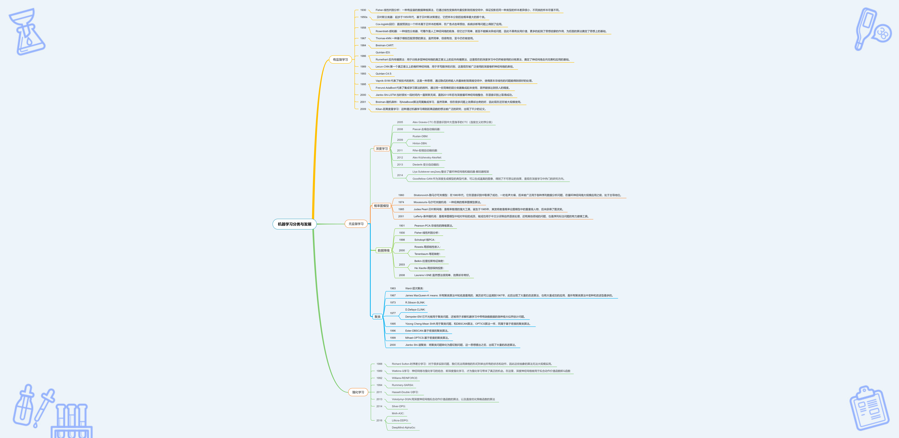
**有监督学习**最早可以追溯到1930年Fisher的线性判别分析，它是通过线性变换将向量投影到低维空间中，并且保证投影后同一类型的样本差异较小。最近提出的是2009年Kilan提出的距离度量学习，可以通过机器学习得到距离函数。

**无监督学习**中可分为深度学习、概率图模型、数据降维、聚类，其中最早的是1901年由Pearson提出的一种非线性降维算法PCA，深度学习则发展时间较短，2005年由Alex Gravas提出的CTC在语音识别中应用广泛。

**强化学习**最早是由Richard Sultion提出的时序差分学习，而目前最近的研究是Mnih在2006年提出的A3C和Lillcra提出的DDPG算法，以及DeepMind公司的AlphaGO。

## 3 机器学习
### 3.1 机器学习概念图
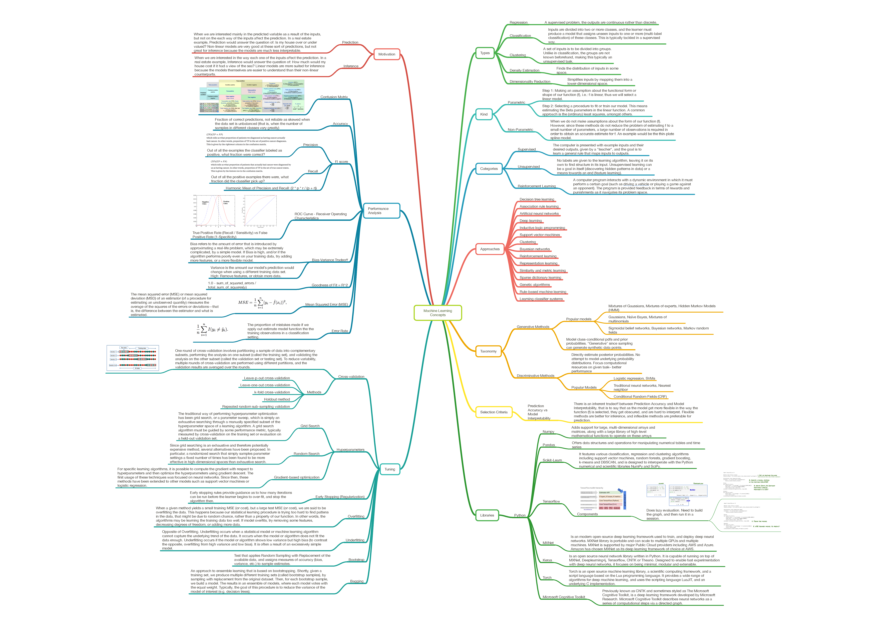
上图是有关机器学习的概念图，包括性能分析方法、计算的方法、选择样本的标准以及目前机器学习依赖的包和库，如tensorflow、numpy等。便于初学者在最短的时间内有方向的入门。

### 3.2 机器学习过程

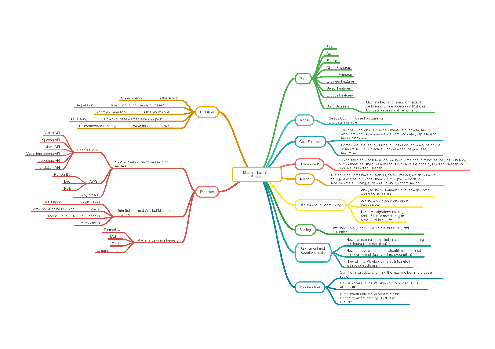

上图是机器学习的基本过程，包括问题的提出、数据的选择、模型的建立、损失函数的计算、最优化处理等。

### 3.3 机器学习数据处理

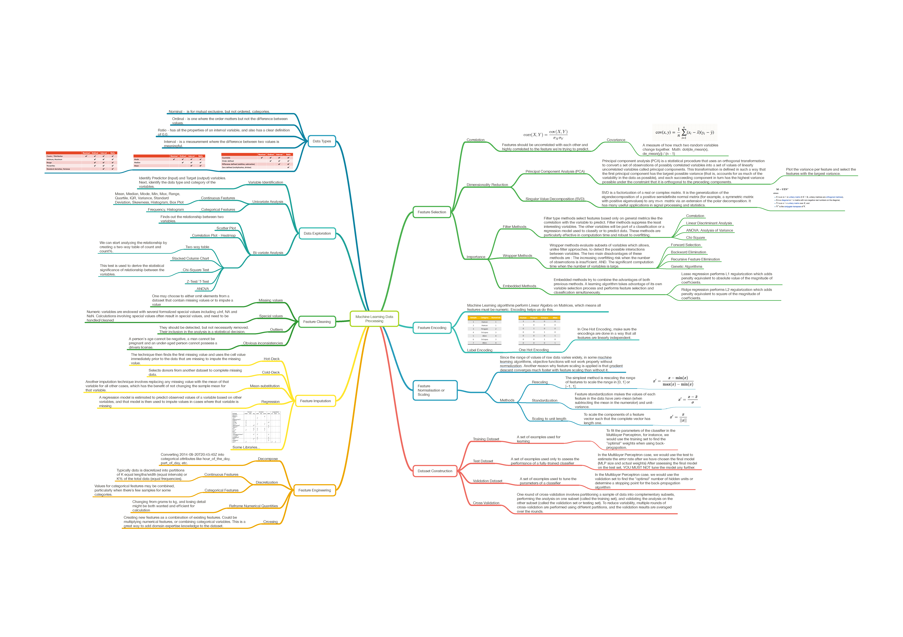

机器学习的基础是算力和数据，其中算力依赖于硬件，而数据的处理也是一个重要的问题。上图中包含了常见数据类型、数据清洗、数据编码等方面的内容。

### 3.4 机器学习模型

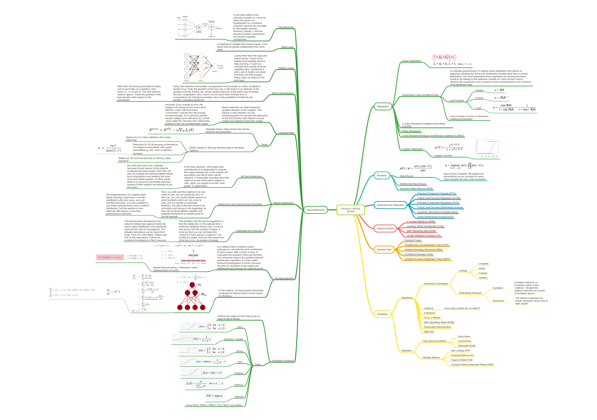

机器学习的模型主要是回归模型、贝叶斯模型、降维、决策树、深度学习等，上图给出了每个分支目前的一些重要的算法和相关概念。

### 3.5 机器学习数学知识

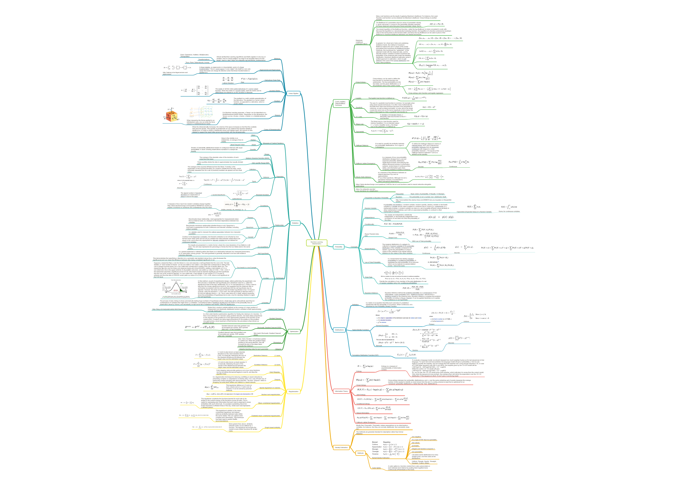

### 3.6 机器学习算法

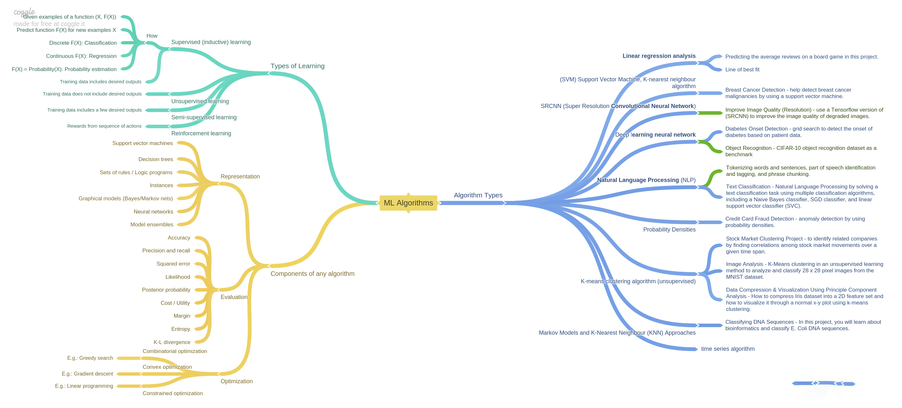

上图给出了各种机器学习的的算法和相关的应用。

### 3.7 机器学习应用

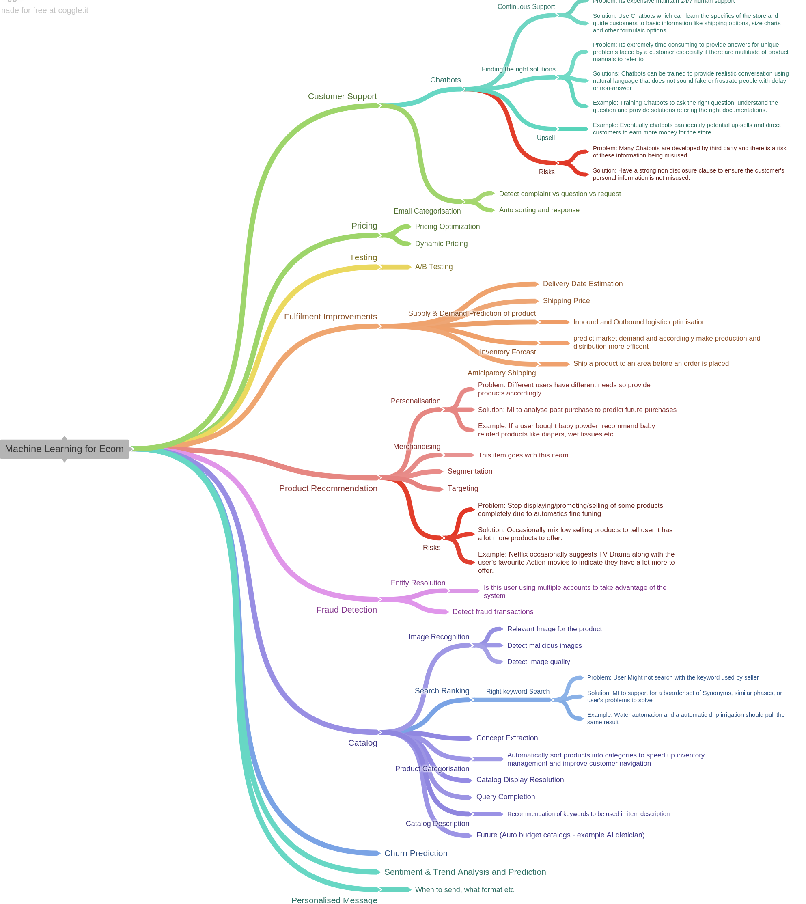

为了更好地认识到机器学习对现在人们生活的影响，上图给出了在大家熟悉的电子商务中，机器学习是如何参与其中，并对电子商务的发展产生了巨大的影响。这也是物联网的一个很小的例子。

## 4 强化学习
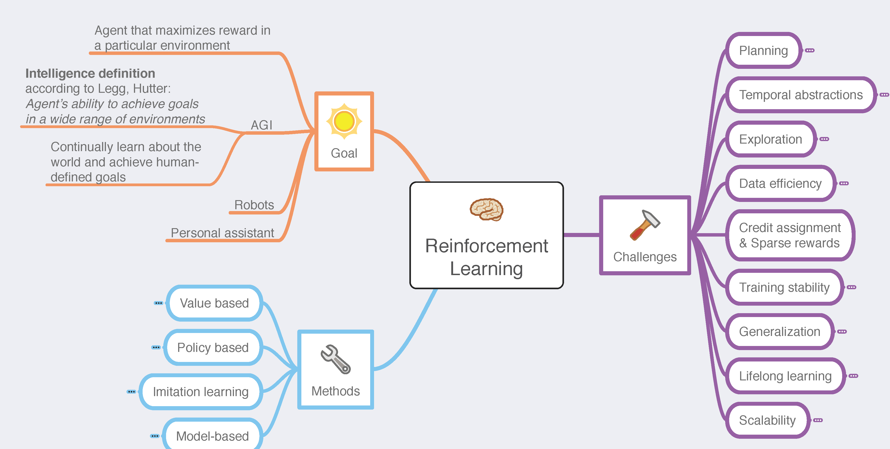

通过搜集资料，针对机器学习分支中的强化学习进行研究，本节给出了当前强化学习发展的方法、目标以及面临的挑战，有助于有志之士投身到目前的主流问题之中。

### 4.1 强化学习的目标
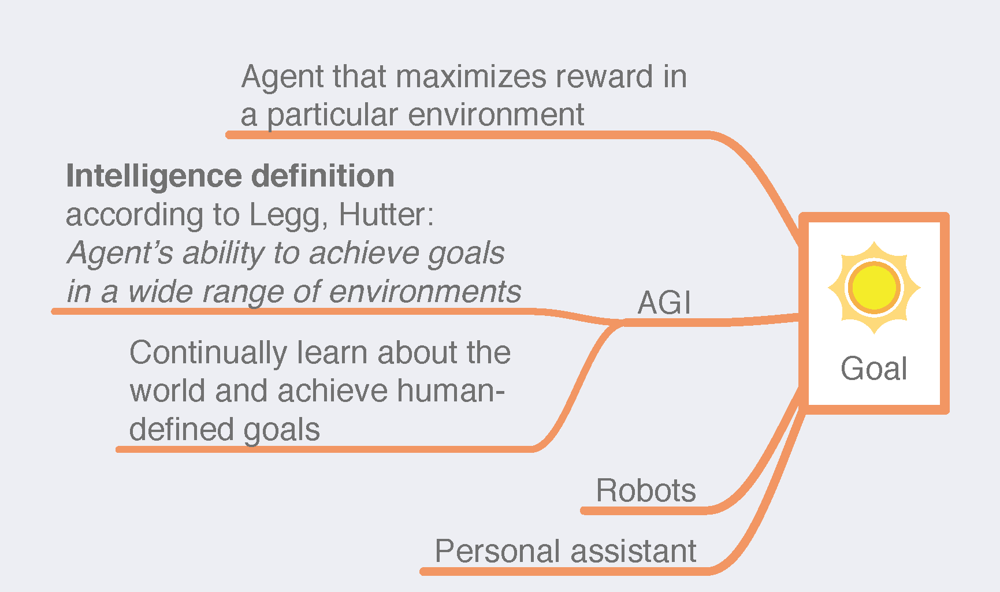

强化学习的目标是什么？是引入了框架来解决设计智能代理的问题。可以通过“在特定环境中获得最大回报的代理商”(an agent that maximizes reward in a particular environmwnt)来进一步规范它。在AGI中，智能被Marcus Hutter和Shane Legg定义为“在各种环境中实现目标的能力”(the ability to achieve goals in a wide range of environments)。

### 4.2 强化学习的方法
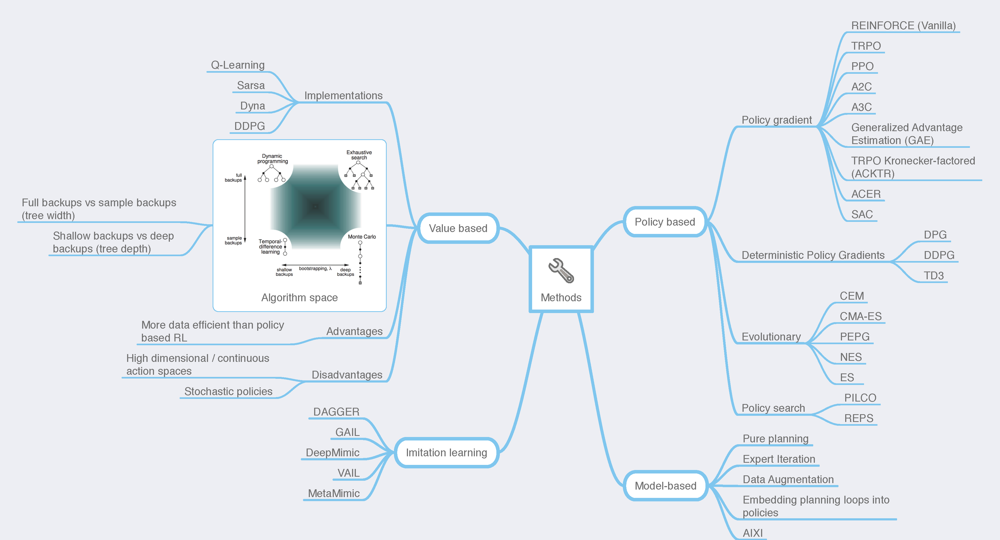

上图给出了从不同方面进行优化的策略，其中在基于值的优化中包含了老师讲的Q-Learning.

### 4.3 强化学习面临的挑战
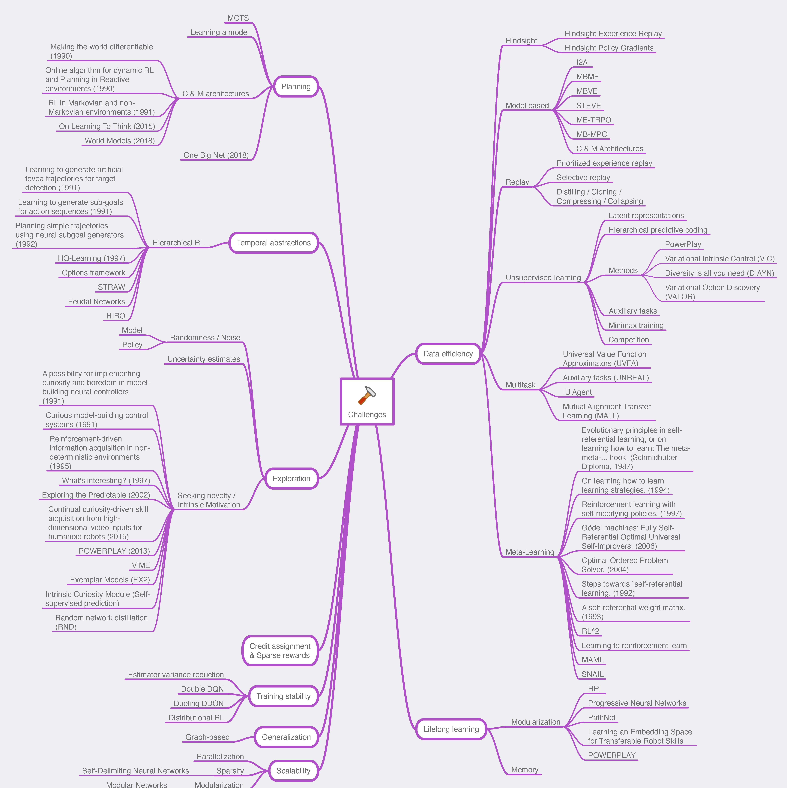

虽然现在人工智能技术如日中天，但都面临一个落地的难题，即当前的主要算法还不能很好地应对各种各样的挑战。因此，基于经典算法开发出有一些专用的算法是十分重要的。上图给出了强化学习在不同场景中应用时面临的挑战，有助于立志将人工智能算法落地的同学尽快了解目前的情况。

